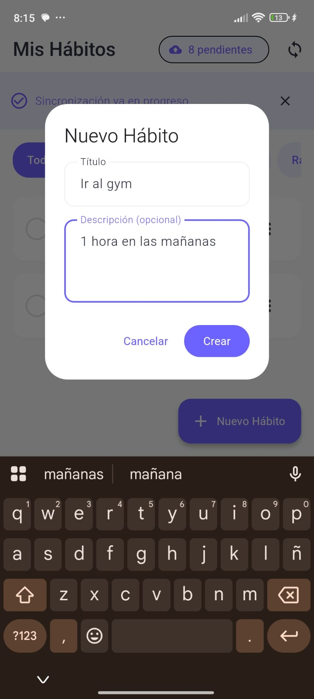
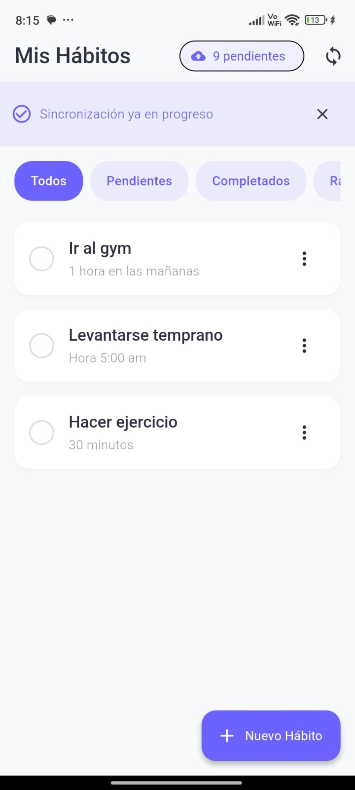
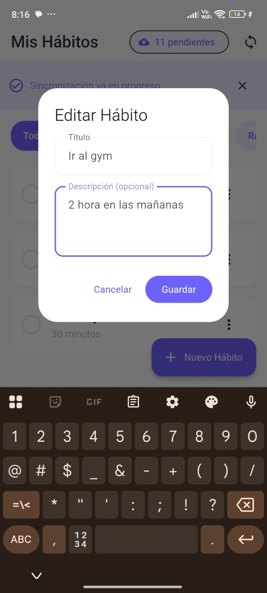
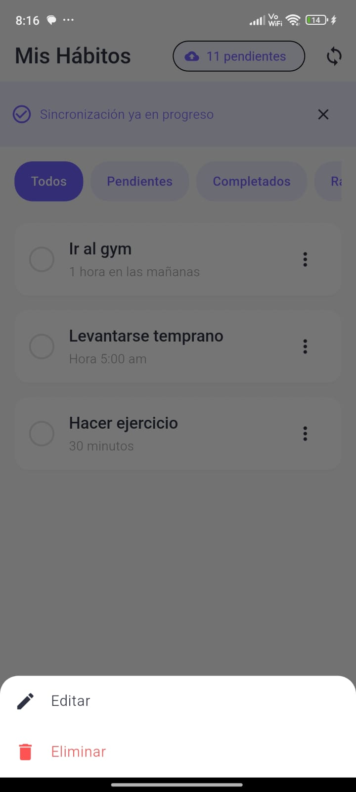
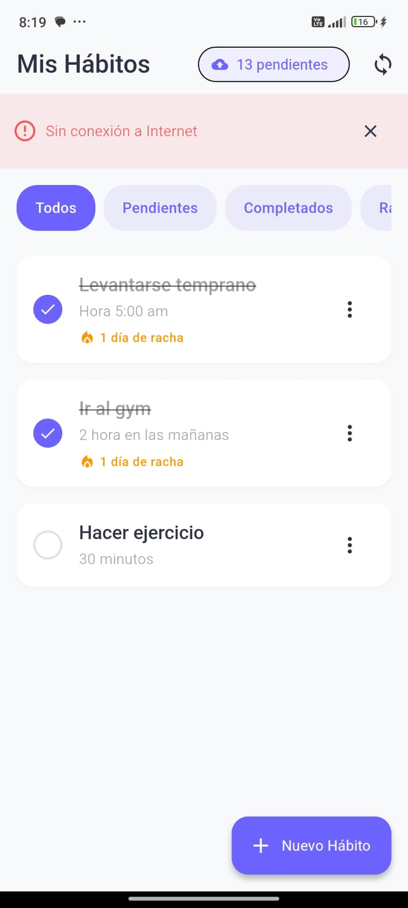
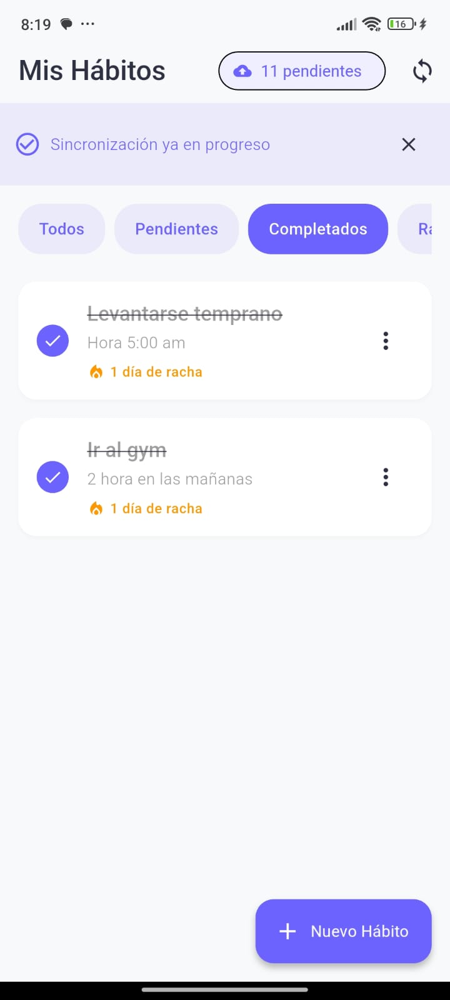
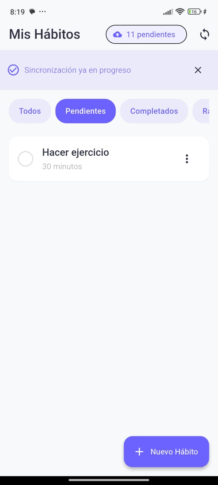

# 🎯 Daily Habit Tracker

> Aplicación móvil Flutter para rastreo de hábitos diarios con arquitectura limpia, persistencia local SQLite y sincronización offline-first.


---

## 📋 Tabla de Contenidos

- [Descripción](#-descripción)
- [Características](#-características)
- [Arquitectura](#-arquitectura-y-tecnologías)
- [Estructura del Proyecto](#-estructura-del-proyecto)
- [Instalación](#-instalación-y-ejecución)
- [Probar Modo Offline](#-cómo-probar-el-modo-offline-y-sincronización)
- [API Mock](#-api-mock)
- [Capturas de Pantalla](#-capturas-de-pantalla)
- [Desarrollo](#-desarrollo)

---

## 📝 Descripción

**Daily Habit Tracker** es una aplicación móvil desarrollada en Flutter que permite a los usuarios gestionar sus hábitos diarios de forma eficiente. La aplicación implementa una **arquitectura limpia (Clean Architecture)** con separación de capas, **gestión de estado con Riverpod**, y una **estrategia offline-first** que garantiza funcionamiento completo sin conexión a internet, sincronizando automáticamente cuando la conectividad se restablece.

### Proyecto Académico
Este proyecto fue desarrollado como parte del taller de evaluación para la asignatura "Electiva Profesional I" del 7º semestre, cumpliendo con todos los requisitos técnicos establecidos.

---

## ✨ Características

### Funcionalidades Principales

- ✅ **CRUD Completo de Hábitos**
  - Crear hábitos con título y descripción opcional
  - Editar hábitos existentes
  - Eliminar hábitos (soft delete)
  - Marcar como completado/pendiente con un tap

- 🔥 **Sistema de Rachas (Streaks)**
  - Contador automático de días consecutivos
  - Visualización con ícono de fuego 🔥
  - Motivación para mantener constancia

- 📊 **Filtros Inteligentes**
  - Ver todos los hábitos
  - Solo pendientes
  - Solo completados
  - Hábitos con racha activa

- 💾 **Modo Offline-First**
  - Funciona completamente sin internet
  - Persistencia local con SQLite
  - Cola de sincronización automática

- ⚡ **Sincronización Inteligente**
  - Detección automática de conectividad
  - Backoff exponencial en reintentos
  - Resolución de conflictos Last-Write-Wins
  - Idempotency-Key para evitar duplicados

- 🎨 **Diseño Moderno**
  - Material Design 3
  - Animaciones fluidas
  - Tipografía Google Fonts (Inter)
  - Tema personalizado con paleta profesional
  - Indicadores visuales de estado de sincronización

---

## 🏗️ Arquitectura y Tecnologías

### Arquitectura: Clean Architecture

El proyecto implementa **Clean Architecture** con separación estricta de responsabilidades:

**Capas del Proyecto:**

1. **🎨 Presentation Layer** (Capa de Presentación)
   - Widgets y Screens
   - Manejo de UI/UX
   - Animaciones

2. **🔌 Providers Layer** (Gestión de Estado)
   - Riverpod Providers
   - StateNotifiers
   - FutureProviders

3. **⚙️ Services Layer** (Capa de Servicios)
   - Lógica de negocio
   - Sincronización
   - Monitoreo de conectividad

4. **📦 Repository Layer** (Capa de Repositorio)
   - Coordinación entre fuentes de datos
   - Estrategia offline-first
   - Gestión de cola de sincronización

5. **💾 Data Layer** (Capa de Datos)
   - **Local**: SQLite, DAOs
   - **Remote**: HTTP Client, API Service

6. **🎯 Core Layer** (Capa Central)
   - Modelos de dominio
   - Configuración y tema

### Stack Tecnológico

| Tecnología | Versión | Propósito |
|------------|---------|-----------|
| **Flutter** | 3.9.2 | Framework principal |
| **Dart** | 3.9.2 | Lenguaje de programación |
| **Riverpod** | 2.5.1 | Gestión de estado |
| **SQLite (sqflite)** | 2.3.3+1 | Base de datos local |
| **HTTP** | 1.2.1 | Cliente REST |
| **Connectivity Plus** | 6.0.5 | Detección de red |
| **UUID** | 4.4.0 | Generación de IDs |
| **Google Fonts** | 6.2.1 | Tipografías |
| **Flutter Animate** | 4.5.0 | Animaciones |
| **json-server** | 0.17.4 | API Mock |

---

## 📁 Estructura del Proyecto

```
daily_habit/
│
├── lib/                                    # Código fuente Dart/Flutter
│   │
│   ├── core/                              # 🎯 CORE LAYER
│   │   ├── models/                        # Modelos de dominio
│   │   │   ├── habit.dart                # Entidad Habit
│   │   │   └── queue_operation.dart      # Entidad QueueOperation
│   │   └── theme/                        # Configuración visual
│   │       └── app_theme.dart           # Tema Material 3
│   │
│   ├── data/                              # 💾 DATA LAYER
│   │   ├── local/                        # Fuente de datos local
│   │   │   ├── database_helper.dart     # Configuración SQLite
│   │   │   ├── habit_dao.dart           # DAO para habits
│   │   │   └── queue_dao.dart           # DAO para cola sync
│   │   │
│   │   ├── remote/                       # Fuente de datos remota
│   │   │   ├── api_client.dart          # Cliente HTTP
│   │   │   ├── api_config.dart          # Configuración API
│   │   │   └── habit_api_service.dart   # Servicio API habits
│   │   │
│   │   └── repositories/                 # 📦 REPOSITORY LAYER
│   │       └── habit_repository.dart    # Lógica offline-first
│   │
│   ├── services/                          # ⚙️ SERVICES LAYER
│   │   └── sync_service.dart            # Sincronización automática
│   │
│   ├── providers/                         # 🔌 PROVIDERS LAYER
│   │   └── habit_providers.dart         # Providers Riverpod
│   │
│   ├── presentation/                      # 🎨 PRESENTATION LAYER
│   │   ├── screens/                      # Pantallas
│   │   │   └── home_screen.dart         # Pantalla principal
│   │   └── widgets/                      # Widgets reutilizables
│   │       └── habit_card.dart          # Card de hábito
│   │
│   └── main.dart                         # Entry point
│
├── api_mock/                              # 🌐 API MOCK
│   ├── db.json                           # Base de datos JSON
│   ├── package.json                      # Configuración npm
│   └── README.md                         # Docs API
│
├── test/                                  # Tests unitarios
├── android/                               # Proyecto Android nativo
├── ios/                                   # Proyecto iOS nativo
├── windows/                               # Proyecto Windows nativo
├── linux/                                 # Proyecto Linux nativo
├── macos/                                 # Proyecto macOS nativo
├── web/                                   # Proyecto Web
│
├── pubspec.yaml                          # Dependencias Flutter
├── README.md                             # Este archivo
├── GUIA_RAPIDA.md                        # Guía de inicio rápido
├── GUIA_PRUEBAS.md                       # Guía de testing
└── CUMPLIMIENTO_REQUISITOS.md            # Checklist del taller
```

### Explicación de Capas

#### 🎯 Core Layer (Núcleo)
- **Modelos**: Entidades del dominio sin dependencias externas
- **Tema**: Configuración visual centralizada
- **Sin lógica de negocio**, solo definiciones

#### 💾 Data Layer (Datos)
- **Local**: Implementación SQLite con patrón DAO
  - `DatabaseHelper`: Singleton para gestión de BD
  - `HabitDao`: Operaciones CRUD en tabla habits
  - `QueueDao`: Gestión de cola de sincronización
  
- **Remote**: Comunicación HTTP con API
  - `ApiClient`: Cliente HTTP genérico con manejo de errores
  - `ApiConfig`: URLs y configuración
  - `HabitApiService`: Endpoints específicos de habits

#### 📦 Repository Layer (Repositorio)
- **Abstrae** la procedencia de los datos
- Implementa **estrategia offline-first**:
  1. Leer de local primero
  2. Escribir en local inmediatamente
  3. Encolar operación para sync
  4. Sincronizar cuando haya conexión

#### ⚙️ Services Layer (Servicios)
- **SyncService**: 
  - Monitorea conectividad
  - Procesa cola de operaciones
  - Backoff exponencial
  - Manejo de errores

#### 🔌 Providers Layer (Estado)
- **Riverpod Providers**: Inyección de dependencias
- **StateNotifiers**: Estado mutable (filtros, sync)
- **FutureProviders**: Datos asíncronos (habits)

#### 🎨 Presentation Layer (Presentación)
- **Screens**: Páginas completas
- **Widgets**: Componentes reutilizables
- **Solo UI**, sin lógica de negocio

---

## 🚀 Instalación y Ejecución

### ⚙️ Prerrequisitos

Antes de comenzar, asegúrate de tener instalado:

- ✅ **Flutter SDK** >= 3.9.2 ([Instalar Flutter](https://docs.flutter.dev/get-started/install))
- ✅ **Dart SDK** >= 3.9.2 (incluido con Flutter)
- ✅ **Node.js** >= 14.x ([Descargar Node.js](https://nodejs.org/))
- ✅ **Git** ([Descargar Git](https://git-scm.com/))
- ✅ Un **emulador Android/iOS** o dispositivo físico
- ✅ **Editor**: VS Code o Android Studio

**Verificar instalación:**
```powershell
flutter doctor -v
node --version
npm --version
```

---

### 📥 Instalación Paso a Paso

#### 1️⃣ Clonar el Repositorio

```powershell
git clone https://github.com/SofiaToro018/daily_habit.git
cd daily_habit
```

#### 2️⃣ Instalar Dependencias de Flutter

```powershell
flutter pub get
```

Esto descargará todas las dependencias listadas en `pubspec.yaml`.

#### 3️⃣ Configurar y Ejecutar el Servidor Mock

**Abrir una nueva terminal** en la carpeta del proyecto:

```powershell
cd api_mock
npm install
```

**Iniciar el servidor:**

```powershell
npm start
```

✅ **Salida esperada:**
```
Resources:
  http://localhost:3000/habits

Home:
  http://localhost:3000
```

⚠️ **Mantén esta terminal abierta** mientras usas la app.

#### 4️⃣ Configurar URL de la API

Edita el archivo `lib/data/remote/api_config.dart` según tu entorno:

**Para Emulador Android:**
```dart
static const String baseUrl = 'http://10.0.2.2:3000';
```

**Para Dispositivo Android Físico:**
```dart
static const String baseUrl = 'http://TU_IP_LOCAL:3000';
```
*(Encuentra tu IP con `ipconfig` en Windows)*

**Para iOS Simulator o Windows/Desktop:**
```dart
static const String baseUrl = 'http://localhost:3000';
```

#### 5️⃣ Ejecutar la Aplicación

**En una nueva terminal:**

```powershell
# Listar dispositivos disponibles
flutter devices

# Ejecutar en el dispositivo deseado
flutter run

# O especificar dispositivo
flutter run -d <device-id>
```

🎉 **¡Listo!** La aplicación debería abrirse en tu dispositivo/emulador.

---

### 🎬 Inicio Rápido (Para Desarrolladores)

```powershell
# Terminal 1: API Mock
cd api_mock && npm install && npm start

# Terminal 2: Flutter App
flutter pub get && flutter run
```

---

## 🧪 Cómo Probar el Modo Offline y Sincronización

### Escenario 1: Crear Hábito Offline

1. **Detener el servidor mock**
   - En la terminal donde corre `npm start`, presiona `Ctrl+C`

2. **O activar Modo Avión** en tu dispositivo/emulador

3. **En la app:**
   - Tap en "Nuevo Hábito"
   - Título: "Hábito Offline"
   - Descripción: "Creado sin conexión"
   - Tap "Crear"

4. **Observar:**
   - ✅ Hábito aparece en la lista
   - ✅ Chip superior muestra "1 pendiente"
   - ✅ No hay errores

### Escenario 2: Sincronización Automática

1. **Con operaciones pendientes**, reinicia el servidor:
   ```powershell
   npm start
   ```

2. **O desactiva Modo Avión** en tu dispositivo

3. **Observar automáticamente:**
   - 📡 Banner "Sincronizando..." aparece
   - ⏳ Spinner en botón de sync
   - ✅ Banner "Sincronización completada"
   - 🔢 Contador de pendientes = 0

### Escenario 3: Sincronización Manual

1. **Con conexión activa**, tap el botón 🔄 en la esquina superior

2. **Observar:**
   - Procesamiento de cola
   - Actualización de contador

### Escenario 4: Verificar Datos en Servidor

1. **Abrir navegador** en: `http://localhost:3000/habits`

2. **Verificar:**
   - Hábitos creados aparecen en JSON
   - Hábitos editados tienen cambios aplicados
   - Hábitos eliminados no aparecen

### Escenario 5: Reintentos con Backoff Exponencial

1. **Detener servidor** mientras tienes operaciones en cola

2. **Editar** varios hábitos

3. **Observar en logs** (consola de Flutter):
   ```
   Intento 1 fallido para <id>, reintentando en 2000ms...
   Intento 2 fallido para <id>, reintentando en 4000ms...
   Intento 3 fallido para <id>, reintentando en 8000ms...
   ```

4. **Reiniciar servidor** y ver sincronización exitosa

### Escenario 6: Persistencia entre Sesiones

1. **Crear 3 hábitos**
2. **Cerrar app completamente** (force quit)
3. **Reabrir app**
4. **Verificar:** Los 3 hábitos siguen presentes

---

## 🎨 Capturas de Pantalla

| Crear Hábito | Listar Hábitos | Editar Hábito |
|:------------:|:--------------:|:-------------:|
|  |  |  |
| *Dialog para agregar nuevo hábito con título y descripción* | *Vista principal con todos los hábitos y filtros activos* | *Modificar título y descripción de hábitos existentes* |

| Eliminar Hábito | Sincronización | Sin Conexión |
|:---------------:|:--------------:|:------------:|
|  |  |  |
| *Confirmación antes de eliminar un hábito permanentemente* | *Banner mostrando estado de sincronización en proceso* | *Funcionamiento completo sin conexión a internet* |

| Vista Completados | Vista Pendientes | Sistema de Rachas |
|:-----------------:|:-----------------:|:----------------:|:-----------------:|
|  |  |  |
| *Filtro mostrando solo hábitos completados del día* | *Filtro mostrando hábitos pendientes por completar* | *Filtro de hábitos con días consecutivos activos 🔥* |
---

## 🎯 Detalles Técnicos Avanzados

### Estrategia Offline-First

La aplicación implementa una estrategia **offline-first** robusta:

**Lecturas (Consultas):**
```dart
Future<List<Habit>> getAllHabits({bool forceRefresh = false}) async {
  // 1. Devolver datos locales inmediatamente
  final localHabits = await _habitDao.getAllHabits();
  
  // 2. Si hay conexión, sincronizar en background
  if (forceRefresh && await _isConnected()) {
    await _syncFromServer(); // No bloquea UI
  }
  
  return localHabits;
}
```

**Escrituras (Modificaciones):**
```dart
Future<Habit> createHabit(String title, {String? description}) async {
  // 1. Guardar en local PRIMERO
  await _habitDao.insertHabit(habit);
  
  // 2. Encolar para sincronización
  await _enqueueOperation(entityId: habit.id, operation: CREATE);
  
  // 3. Intentar sync inmediata (no bloquea si falla)
  if (await _isConnected()) {
    _trySyncOperation(habit.id);
  }
  
  return habit;
}
```

### Cola de Sincronización

**Tabla `queue_operations`:**
- Almacena operaciones pendientes (CREATE, UPDATE, DELETE)
- Incluye contador de intentos y último error
- Se procesa en orden FIFO

**Backoff Exponencial:**
```dart
int delayMs = baseDelay * (2 ^ attempt);
// Intento 1: 1s
// Intento 2: 2s
// Intento 3: 4s
// Intento 4: 8s
// Intento 5: 16s (máximo 30s)
```

**Idempotency-Key:**
- Se usa el ID de la operación en cola
- Evita duplicados en reintentos
- Header HTTP: `Idempotency-Key: <operation-id>`

### Resolución de Conflictos

**Last-Write-Wins (LWW):**
```dart
if (remoteHabit.updatedAt.isAfter(localHabit.updatedAt)) {
  await _habitDao.updateHabit(remoteHabit); // Servidor gana
} else {
  // Local es más reciente, se sincronizará al servidor
}
```

### Gestión de Estado

**Providers Riverpod:**
```dart
// Repository provider
final habitRepositoryProvider = Provider<HabitRepository>(...);

// Future provider para lista de hábitos
final habitsProvider = FutureProvider<List<Habit>>(...);

// State notifier para filtros
final habitFilterProvider = StateNotifierProvider<HabitFilterNotifier, HabitFilter>(...);

// Filtrado reactivo
final filteredHabitsProvider = FutureProvider<List<Habit>>((ref) {
  final filter = ref.watch(habitFilterProvider);
  final repository = ref.watch(habitRepositoryProvider);
  // Retorna hábitos según filtro activo
});
```

### Manejo de Errores

**Excepciones Personalizadas:**
```dart
try {
  final response = await _client.get(uri).timeout(Duration(seconds: 10));
  return _handleResponse(response);
} on SocketException {
  throw NetworkException('Sin conexión a Internet');
} on TimeoutException {
  throw ApiTimeoutException('Request timeout');
} on HttpException catch (e) {
  throw ApiException('HTTP Error: $e', statusCode);
}
```

**Manejo en UI:**
```dart
habitsAsync.when(
  data: (habits) => ListView(...),
  loading: () => CircularProgressIndicator(),
  error: (error, stack) => ErrorWidget(error),
);
```

## 📚 API Mock (json-server)

### Endpoints Disponibles

| Método | Endpoint      | Descripción                |
|--------|---------------|----------------------------|
| GET    | /habits       | Obtener todos los hábitos  |
| GET    | /habits/:id   | Obtener un hábito          |
| POST   | /habits       | Crear un hábito            |
| PUT    | /habits/:id   | Actualizar un hábito       |
| DELETE | /habits/:id   | Eliminar un hábito         |

### Formato de Datos

```json
{
  "id": "uuid",
  "title": "Título del hábito",
  "description": "Descripción opcional",
  "completed": false,
  "updatedAt": "2025-11-18T08:00:00.000Z",
  "deleted": false,
  "lastCompletedAt": null,
  "streak": 0
}
```

## 🎨 Diseño y UX

- **Material Design 3** con paleta de colores moderna
- **Animaciones fluidas** con flutter_animate
- **Tipografía Google Fonts** (Inter)
- **Diseño responsive** y adaptativo
- **Indicadores visuales** de estado de sincronización
- **Sistema de rachas** con iconos de fuego 🔥

## 🔐 Persistencia Local

### Esquema de Base de Datos

#### Tabla `habits`
```sql
CREATE TABLE habits (
  id TEXT PRIMARY KEY,
  title TEXT NOT NULL,
  description TEXT,
  completed INTEGER NOT NULL DEFAULT 0,
  updated_at TEXT NOT NULL,
  deleted INTEGER NOT NULL DEFAULT 0,
  last_completed_at TEXT,
  streak INTEGER NOT NULL DEFAULT 0
);
```

#### Tabla `queue_operations`
```sql
CREATE TABLE queue_operations (
  id TEXT PRIMARY KEY,
  entity TEXT NOT NULL,
  entity_id TEXT NOT NULL,
  op TEXT NOT NULL,
  payload TEXT NOT NULL,
  created_at INTEGER NOT NULL,
  attempt_count INTEGER NOT NULL DEFAULT 0,
  last_error TEXT
);
```

## 🧪 Testing

```bash
# Ejecutar tests unitarios
flutter test

# Ejecutar tests con cobertura
flutter test --coverage
```

## 📖 Documentación del Código

Cada clase y método está documentado siguiendo las convenciones de Dart:

```dart
/// Descripción breve de la clase
/// 
/// Descripción detallada del propósito y funcionamiento.
class Example {
  /// Descripción del método
  /// 
  /// [param1] - Descripción del parámetro
  /// Returns: Descripción del valor de retorno
  void method(String param1) {
    // Implementación
  }
}
```

## 🚀 Próximas Mejoras

- [ ] Notificaciones push para recordatorios
- [ ] Gráficos de progreso semanal/mensual
- [ ] Categorías de hábitos
- [ ] Modo oscuro
- [ ] Exportar/Importar datos
- [ ] Autenticación de usuarios
- [ ] Sincronización en la nube

## 👨‍💻 Desarrollo

### Comandos Útiles

```powershell
# Verificar instalación de Flutter
flutter doctor -v

# Analizar código (lints)
flutter analyze

# Formatear código automáticamente
dart format lib/

# Limpiar builds anteriores
flutter clean
flutter pub get

# Ejecutar tests
flutter test

# Ejecutar con logs detallados
flutter run -v

# Generar APK release
flutter build apk --release

# Generar bundle para Play Store
flutter build appbundle

# Ver dependencias desactualizadas
flutter pub outdated
```

### Debugging

**Ver logs de SQLite:**
```dart
// En DatabaseHelper.dart, descomentar:
await db.execute('PRAGMA foreign_keys = ON');
print('Tabla creada: ${await db.query("sqlite_master")}');
```

**Inspeccionar base de datos:**
```powershell
# Buscar archivo de BD
flutter pub run sqflite:sqflite

# O usar DB Browser for SQLite
# https://sqlitebrowser.org/
```

**Ver operaciones en cola:**
```dart
final queueDao = QueueDao();
final ops = await queueDao.getPendingOperations();
print('Operaciones pendientes: ${ops.length}');
```

---

## 🐛 Troubleshooting

### ❌ Error: "Cannot connect to API"

**Síntomas:**
- App no sincroniza
- Banner de error: "Sin conexión a Internet"
- Operaciones quedan en cola

**Soluciones:**

1. **Verificar que json-server esté corriendo:**
   ```powershell
   # En terminal api_mock/
   npm start
   ```
   Debería mostrar: `http://localhost:3000/habits`

2. **Verificar URL en `api_config.dart`:**
   ```dart
   // Para emulador Android
   static const String baseUrl = 'http://10.0.2.2:3000';
   
   // NO uses 'localhost' en emulador Android
   ```

3. **Para dispositivo físico:**
   ```powershell
   # Encuentra tu IP
   ipconfig
   # Busca IPv4 (ej: 192.168.1.100)
   ```
   ```dart
   static const String baseUrl = 'http://192.168.1.100:3000';
   ```

4. **Firewall Windows:**
   - Buscar "Firewall de Windows"
   - Permitir Node.js en puerto 3000
   - O desactivar temporalmente

5. **Verificar en navegador:**
   - Abrir: `http://localhost:3000/habits`
   - Deberías ver JSON con hábitos

---

### ❌ Error: "Bad state: databaseFactory not initialized"

**Solución:**

En `lib/main.dart`, agregar antes de `runApp()`:

```dart
import 'package:sqflite_common_ffi/sqflite_ffi.dart';

void main() {
  // Para plataformas desktop (Windows/Linux/macOS)
  if (Platform.isWindows || Platform.isLinux || Platform.isMacOS) {
    sqfliteFfiInit();
    databaseFactory = databaseFactoryFfi;
  }
  
  runApp(const ProviderScope(child: MyApp()));
}
```

Agregar en `pubspec.yaml`:
```yaml
dependencies:
  sqflite_common_ffi: ^2.3.0
```

---

### ❌ Error: "Cannot find package" después de pub get

**Solución:**
```powershell
flutter clean
flutter pub cache repair
flutter pub get
```

---

### ❌ Operaciones no se sincronizan

**Verificar:**

1. **Logs en consola:**
   ```
   Operación <id> eliminada tras 5 intentos
   ```
   → Significa que falló 5 veces (máximo)

2. **Ver contador de pendientes:**
   - Chip en AppBar muestra número
   - Si no baja, hay problemas de conectividad

3. **Forzar sincronización:**
   - Tap botón 🔄
   - Ver logs de error en consola

4. **Limpiar cola (último recurso):**
   ```dart
   final queueDao = QueueDao();
   await queueDao.deleteAllOperations();
   ```

---

### ❌ Hábitos duplicados después de sync

**Causa:** Idempotency-Key no funcionando

**Verificar:**
- Revisar logs de red
- Asegurarse que `operation.id` sea único
- json-server debería rechazar duplicados con mismo ID

---

### ❌ App lenta con muchos hábitos

**Optimización:**

1. **Agregar paginación:**
   ```dart
   Future<List<Habit>> getHabits({int limit = 50, int offset = 0})
   ```

2. **Índices en SQLite:**
   ```sql
   CREATE INDEX idx_habits_updated ON habits(updated_at DESC);
   ```

3. **Caché de imágenes** (si agregas imágenes)

---

### 🆘 Ayuda Adicional

**Recursos:**
- 📖 [Documentación Flutter](https://docs.flutter.dev)
- 📖 [Riverpod Docs](https://riverpod.dev)
- 📖 [SQLite Tutorial](https://www.sqlitetutorial.net/)
- 📖 [Ver issues en GitHub](https://github.com/SofiaToro018/daily_habit/issues)

**Logs útiles:**
```powershell
# Ver logs en tiempo real
flutter logs

# Ver logs con filtro
flutter logs | findstr "Sync"
```

---

## 👥 Autores

<table>
  <tr>
    <td align="center">
      <a href="https://github.com/SofiaToro018">
        <br />
        <sub><b>Laura Sofia Toro</b></sub>
      </a><br />
      <sub>Desarrollo Full Stack</sub><br/>
      <sub>7º Semestre - Electiva Prof. I</sub>
    </td>
  </tr>
</table>

**Contacto:**
- 💼 LinkedIn: [www.linkedin.com/in/sofia-toro091025]

---

### Versión 1.1 (Próximamente)
- [ ] Notificaciones push para recordatorios
- [ ] Modo oscuro (Dark theme)
- [ ] Widgets para pantalla de inicio

### Versión 1.2
- [ ] Gráficos de progreso semanal/mensual
- [ ] Categorías de hábitos con colores
- [ ] Exportar/Importar datos (JSON, CSV)

### Versión 2.0
- [ ] Backend real (Firebase/Supabase)
- [ ] Autenticación de usuarios
- [ ] Sincronización en la nube
- [ ] Modo colaborativo (compartir hábitos)

---

## 📚 Referencias y Recursos

### Documentación Oficial
- [Flutter Documentation](https://docs.flutter.dev/)
- [Dart Language Tour](https://dart.dev/guides/language/language-tour)
- [Riverpod Documentation](https://riverpod.dev/)
- [SQLite Documentation](https://www.sqlite.org/docs.html)

### Tutoriales Relacionados
- [Flutter Clean Architecture](https://resocoder.com/flutter-clean-architecture/)
- [Offline-First Apps with Flutter](https://medium.com/flutter-community)
- [Riverpod State Management](https://codewithandrea.com/articles/flutter-state-management-riverpod/)

### Artículos Técnicos
- [Last-Write-Wins Conflict Resolution](https://en.wikipedia.org/wiki/Conflict-free_replicated_data_type)
- [Exponential Backoff Algorithm](https://en.wikipedia.org/wiki/Exponential_backoff)
- [RESTful API Design Best Practices](https://restfulapi.net/)

---

<div align="center">

### ⭐ Si este proyecto te fue útil, considera darle una estrella

**Desarrollado con ❤️ usando Flutter**


© 2025 Laura Sofia Toro - Todos los derechos reservados

</div>

